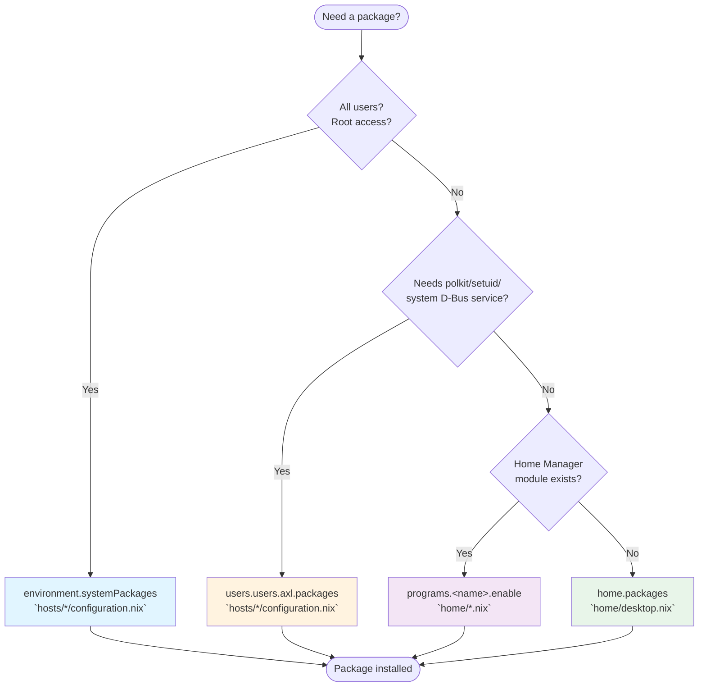

# Package Declaration Guide

Where to declare packages in a NixOS + Home Manager configuration.

NixOS owns the system — services, root access, shared state. Home Manager owns
the user environment — dotfiles, shell tools, typed configuration. Packages sit
at different levels because some need system integration (D-Bus system services,
polkit, setuid helpers) that Home Manager cannot provide, while others are pure
user tools that have no business touching the system layer. The four locations
reflect that boundary.

## Decision Flowchart



## Quick Reference

### 1. `environment.systemPackages`

**Location:** `hosts/*/configuration.nix`  
**Use for:** System-wide tools, root access, all users

Examples:

- System utilities: `file`, `htop`, `iftop`, `iotop`, `net-tools`
- System administration: `clamav`, `cryptsetup`, `plocate`
- Network tools: `nethogs`

### 2. `users.users.<name>.packages`

**Location:** `hosts/*/configuration.nix`  
**Use for:** User-specific packages needing system integration

This tier exists for packages that need genuine system-level integration —
polkit actions, D-Bus system services, setuid helpers — that Home Manager cannot
provide from the user profile alone. Browsers do not inherently need this:
Firefox, ungoogled-chromium, and Brave all install fine via `home.packages` and
resolve correctly for MIME/desktop-file discovery. No package in this repo
currently requires this tier.

Examples:

- Apps requiring system services or D-Bus integration not satisfiable from the
  user profile

### 3. `home.packages`

**Location:** `home/desktop.nix` or `home/gnome.nix` (GUI apps)  
**Use for:** Most user CLI tools and development packages

Examples in `home/desktop.nix`:

- Version control: `tig`, `gitflow`
- CLI tools: `curl`, `wget`, `tokei`, `fdupes`, `bfs`
- Media: `ffmpeg`, `mpv`

Examples in `home/gnome.nix`:

- Browsers: `brave`, `firefox`, `ungoogled-chromium`
- GUI apps: `obsidian`, `celluloid`, `gparted`
- GNOME extensions

### 4. `programs.<name>.enable`

**Location:** `home/*.nix` (dedicated module file)  
**Use for:** Tools with Home Manager configuration modules

Examples:

- Shell: `programs.zsh` → `home/zsh.nix`
- Terminal: `programs.kitty` → `home/kitty.nix`
- Version control: `programs.git` → `home/git.nix`
- Editor: `programs.helix` → `home/helix.nix`
- Editor: `programs.neovim` → `home/neovim.nix`
- Prompt: `programs.starship` → `home/starship.nix`
- File browser: `programs.ranger` → `home/ranger.nix`

## Checking for Home Manager Modules

```bash
# Search for available programs
man home-configuration.nix | grep -A2 "programs\."

# Or check online
# https://home-manager-options.extranix.com/
```
