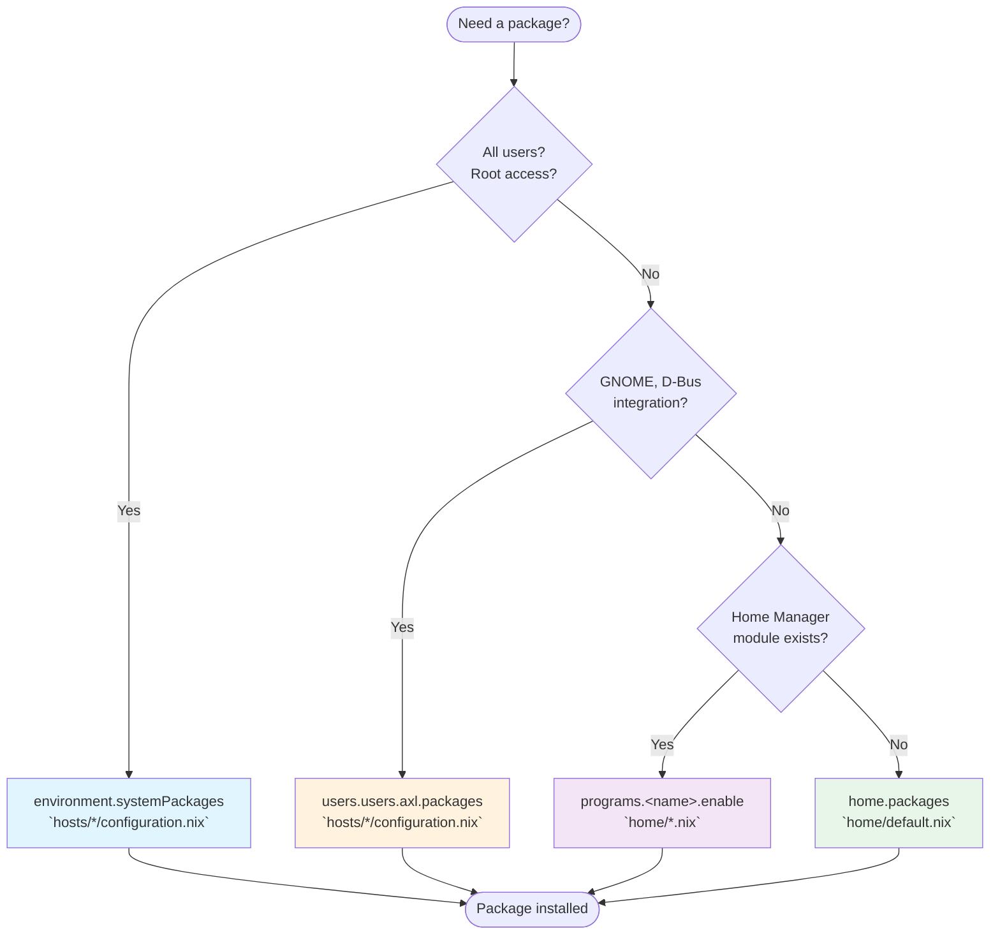

# Package Declaration Guide

Where to declare packages in a NixOS + Home Manager configuration.

## Decision Flowchart



## Quick Reference

### 1. `environment.systemPackages`

**Location:** `hosts/*/configuration.nix`  
**Use for:** System-wide tools, root access, all users

Examples:
- System utilities: `file`, `htop`, `iftop`, `iotop`, `net-tools`
- System administration: `clamav`, `cryptsetup`, `plocate`
- Network tools: `nethogs`

### 2. `users.users.<name>.packages`

**Location:** `hosts/*/configuration.nix`  
**Use for:** User-specific packages needing system integration

Examples:
- Browsers: `brave`
- Apps requiring system services or D-Bus integration

### 3. `home.packages`

**Location:** `home/default.nix` or `home/gnome.nix` (GUI apps)  
**Use for:** Most user CLI tools and development packages

Examples in `home/default.nix`:
- Version control: `tig`, `gitflow`
- CLI tools: `curl`, `wget`, `tokei`, `fdupes`, `bfs`
- Media: `ffmpeg`, `mpv`

Examples in `home/gnome.nix`:
- Browsers: `firefox`, `ungoogled-chromium`
- GUI apps: `obsidian`, `celluloid`, `gparted`
- GNOME extensions

### 4. `programs.<name>.enable`

**Location:** `home/*.nix` (dedicated module file)  
**Use for:** Tools with Home Manager configuration modules

Examples:
- Shell: `programs.zsh` → `home/zsh.nix`
- Terminal: `programs.kitty` → `home/kitty.nix`
- Version control: `programs.git` → `home/git.nix`
- Editor: `programs.helix` → `home/helix.nix`
- Editor: `programs.neovim` → `home/neovim.nix`
- Prompt: `programs.starship` → `home/starship.nix`
- File browser: `programs.ranger` → `home/ranger.nix`

## Checking for Home Manager Modules

```bash
# Search for available programs
man home-configuration.nix | grep -A2 "programs\."

# Or check online
# https://home-manager-options.extranix.com/
```
