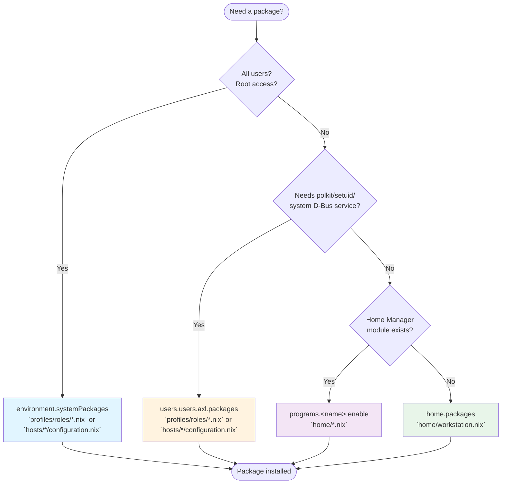

# Package and Configuration Declaration Guide

Where to declare packages in a NixOS + Home Manager configuration.

NixOS owns the system — services, root access, shared state. Home Manager owns
the user environment — dotfiles, shell tools, typed configuration. Packages sit
at different levels because some need system integration (D-Bus system services,
polkit, setuid helpers) that Home Manager cannot provide, while others are pure
user tools that have no business touching the system layer. The four locations
reflect that boundary.

## Decision Flowchart


```mermaid
flowchart TD
    Start([Need a package?]) --> Q1{All users?<br/>Root access?}
    Q1 -->|Yes| Sys[environment.systemPackages<br/>`profiles/roles/*.nix` or `hosts/*/configuration.nix`]
    Q1 -->|No| Q2{Needs polkit/setuid/<br/>system D-Bus service?}
    Q2 -->|Yes| User[users.users.axl.packages<br/>`profiles/roles/*.nix` or `hosts/*/configuration.nix`]
    Q2 -->|No| Q3{Home Manager<br/>module exists?}
    Q3 -->|Yes| Prog[programs.&lt;name&gt;.enable<br/>`home/*.nix`]
    Q3 -->|No| Home[home.packages<br/>`home/workstation.nix`]

    Sys --> End([Package installed])
    User --> End
    Prog --> End
    Home --> End

    style Sys fill:#e1f5ff
    style User fill:#fff3e0
    style Prog fill:#f3e5f5
    style Home fill:#e8f5e9
```

## Quick Reference

### 1. `environment.systemPackages`

**Location:** `profiles/roles/*.nix` (shared) or `hosts/*/configuration.nix` (one host)  
**Use for:** System-wide tools, root access, all users

Examples:

- System utilities: `file`, `htop`, `iftop`, `iotop`, `net-tools`
- System administration: `clamav`, `cryptsetup`, `plocate`
- Network tools: `nethogs`

### 2. `users.users.<name>.packages`

**Location:** `profiles/roles/*.nix` (shared) or `hosts/*/configuration.nix` (one host)  
**Use for:** User-specific packages needing system integration

This tier exists for packages that need genuine system-level integration —
polkit actions, D-Bus system services, setuid helpers — that Home Manager cannot
provide from the user profile alone. Browsers do not inherently need this:
Firefox, ungoogled-chromium, and Brave all install fine via `home.packages` and
resolve correctly for MIME/desktop-file discovery. No package in this repo
currently requires this tier.

Examples:

- Apps requiring system services or D-Bus integration not satisfiable from the
  user profile

### 3. `home.packages`

**Location:** `home/workstation.nix` or `home/gnome.nix` (GUI apps)  
**Use for:** Most user CLI tools and development packages

Examples in `home/workstation.nix`:

- Version control: `tig`, `gitflow`
- CLI tools: `curl`, `wget`, `tokei`, `fdupes`, `bfs`
- Media: `ffmpeg`, `mpv`

Examples in `home/gnome.nix`:

- Browsers: `brave`, `firefox`, `ungoogled-chromium`
- GUI apps: `obsidian`, `celluloid`, `gparted`
- GNOME extensions

### 4. `programs.<name>.enable`

**Location:** `home/*.nix` (dedicated module file)  
**Use for:** Tools with Home Manager configuration modules

Examples:

- Shell: `programs.zsh` → `home/zsh.nix`
- Terminal: `programs.kitty` → `home/kitty.nix`
- Version control: `programs.git` → `home/git.nix`
- Editor: `programs.helix` → `home/helix.nix`
- Editor: `programs.neovim` → `home/neovim.nix`
- Prompt: `programs.starship` → `home/starship.nix`
- File browser: `programs.ranger` → `home/ranger.nix`

## Configuration Ownership

Home Manager owns packages, shell integration, and deployment. Configuration
does not have to be embedded in Nix to remain declarative or reproducible:
tracked native files referenced by Home Manager are included in the Nix store
and participate in generations and rollback.

Use Nix for structured options, dependencies, and host-specific composition.
Use native files for substantial scripts, application languages, and static
configuration that gains nothing from Nix evaluation.

- Keep package selection, plugins, and integration in `home/*.nix` so Nix
  controls dependencies and deployment.
- Keep small structured settings and host overrides in `home/*.nix` for module
  merging, option types, `mkDefault`, and `mkForce`.
- Keep substantial Lua, shell code, and native command fragments in
  `files/<tool>/` for native highlighting, diagnostics, formatting, and parsing.
- Import string-heavy TOML or JSON into `settings` for native editing with
  Home Manager composition.

Keep filenames under `files/` visible, without a leading dot. Home Manager maps
them to the application's expected hidden or XDG path. Edit repository sources,
not generated files in the home directory. Referenced files are not live links
to the working tree: normal Home Manager activation is still required to deploy
changes.

### Whole Files, Fragments, and Structured Imports

Use `.source` when Home Manager should deploy the complete file, as in
`home/nushell.nix`:

```nix
programs.nushell.configFile.source = ../files/nushell/config.nu;
```

Use `builtins.readFile` when a module should incorporate a native fragment into
the configuration it generates:

```nix
programs.tmux.extraConfig = builtins.readFile ../files/tmux/tmux.conf;
```

Use a parsed import when the native data should remain structured and mergeable:

```nix
programs.starship.settings =
  builtins.fromTOML (builtins.readFile ../files/starship/starship.toml);
```

`builtins.fromJSON` provides the equivalent for JSON, not JSONC. Parsed imports
preserve values, not comments or formatting in generated output. `readFile`
does not interpret `${...}` in the file as Nix interpolation. Keep genuinely
Nix-dependent values in a small Nix definition rather than turning the entire
native file into a template.

Do not assign `.source` to a destination already generated by a program module.
Choose one owner for each destination, and do not duplicate the same setting in
both a native fragment and a structured option.

### Current Boundaries

- Git, bat, and host overrides remain structured in Nix.
- tmux core options and plugins remain in Nix; native commands live in
  `files/tmux/tmux.conf` and are appended through `extraConfig`.
- dircolors integration remains in Nix; the static database lives in
  `files/dircolors/dir_colors`.
- Starship integration remains in Nix; `files/starship/starship.toml` is imported
  into `settings`.
- Neovim packages remain in Nix; `files/neovim/init.lua` holds editor settings
  and highlight overrides, and `files/neovim/plugins.lua` holds plugin setup.
  The native plugin file is attached to the final configured plugin, keeping
  setup in Home Manager's generated plugin configuration. This preserves its
  order relative to setup injected by other modules. Keep custom setup in that
  file so its order is explicit; do not move it to a separate `initLua` override.
- Nushell, Zsh, and Julia retain their existing native-file approach.

Native files make language tooling available; they do not install or configure
that tooling automatically. Nix language servers understand Nix options, but a
free-form `settings` attribute is not necessarily a complete application schema.
Embedded-language highlighting does not guarantee native diagnostics or linting.
See [validation.md](validation.md#native-configuration-checks) for repeatable checks.

## Checking for Home Manager Modules

```bash
# Search for available programs
man home-configuration.nix | grep -A2 "programs\."

# Or check online
# https://home-manager-options.extranix.com/
```
