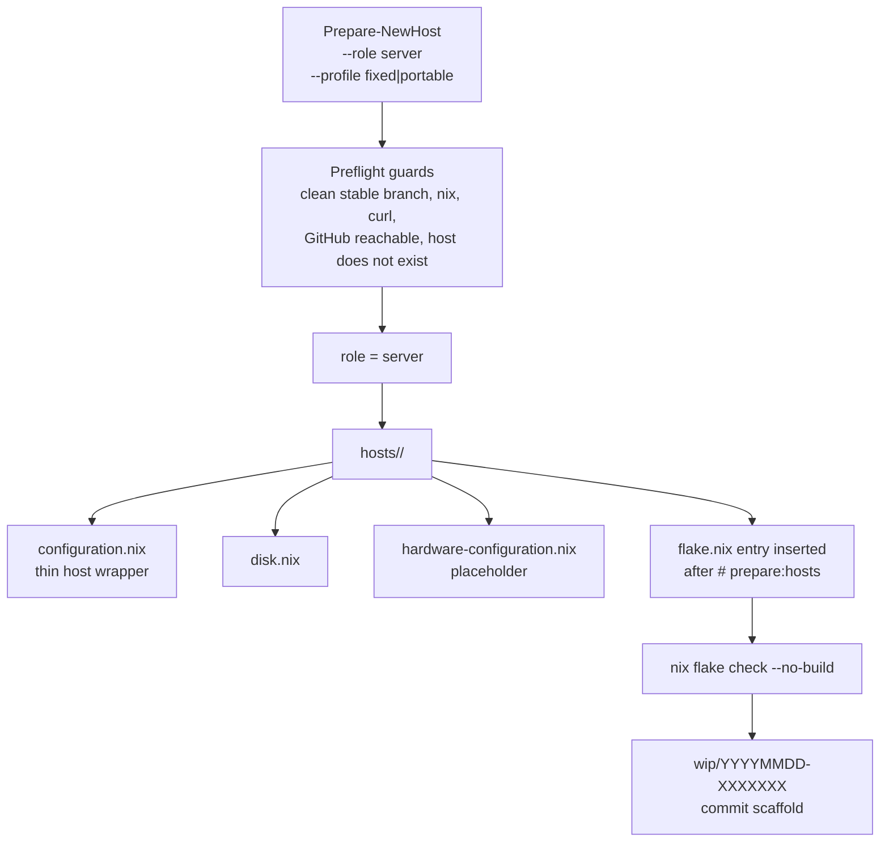
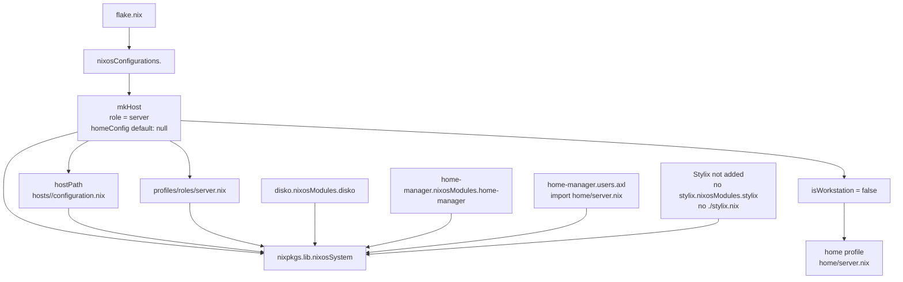
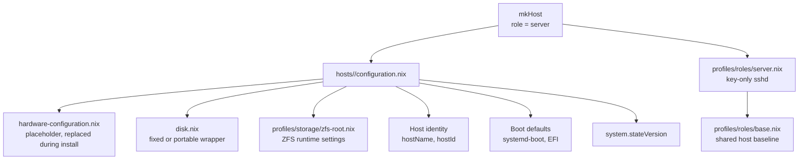
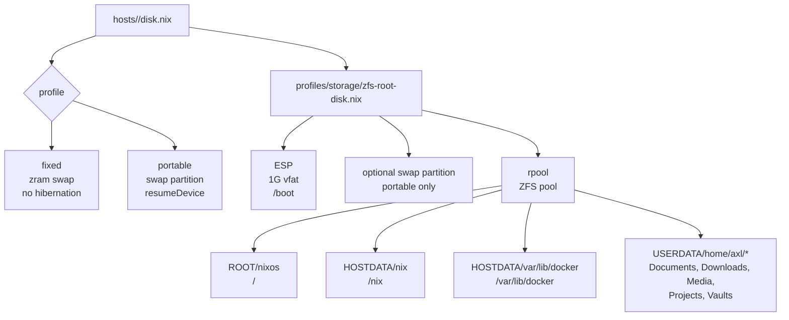
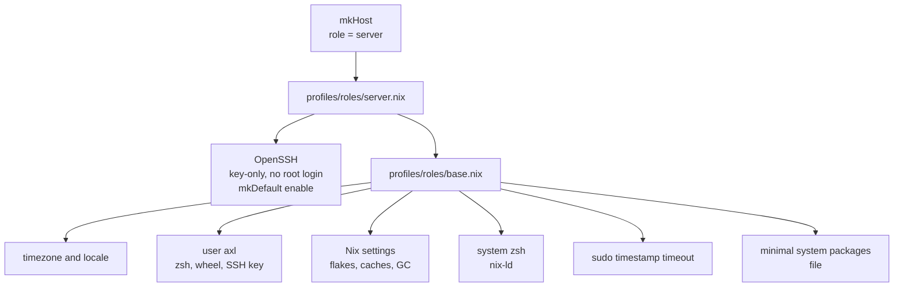
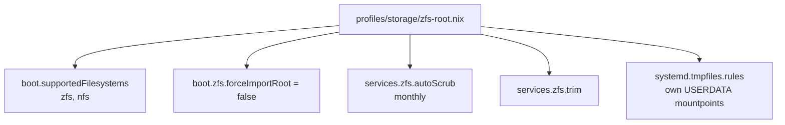
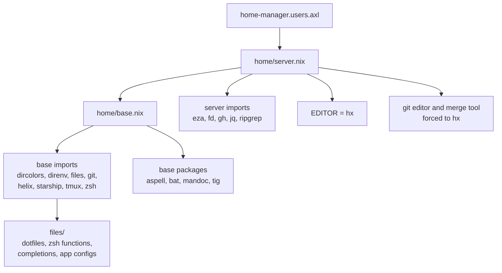
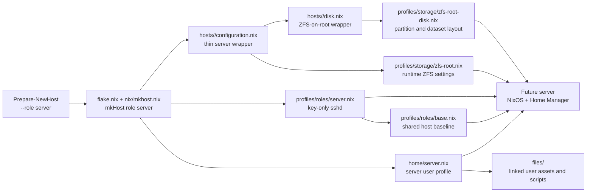

# Server Configuration Route

This document shows what future Nixotic server hosts look like when they are
scaffolded through `Prepare-NewHost` and evaluated through `flake.nix`.

It describes the reusable server shape. Existing server-like hosts may differ:
`cre8r` currently has its own ext4 VM layout and imports
`profiles/platform/proxmox-vm.nix`, `illumin8r` is a WSL host importing
`profiles/platform/wsl.nix`, while future scaffolded servers import the shared
ZFS-on-root runtime module and use the shared ZFS-on-root disk wrapper.

The diagrams show configuration composition and ownership boundaries. They do
not show imperative execution order; NixOS and Home Manager modules are merged
by their respective module systems.

Unless stated otherwise, diagrams in this document describe the scaffolded
future-state route, not every current server-like host.

## Scaffold Route

A future server normally starts with `Prepare-NewHost`.

```bash
Prepare-NewHost <hostname> --role server --profile fixed
```

Portable servers are possible, but unusual:

```bash
Prepare-NewHost <hostname> --role server --profile portable
```

Unlike workstations, server hosts must pass `--role server` if they should get
the server path. The default role is `workstation`.



The generated flake entry for a server is explicit:

```nix
<hostname> = mkHost {
  hostPath = ./hosts/<hostname>/configuration.nix;
  role = "server";
};
```

That `role = "server"` is what selects the server system role module, the
server Home Manager profile, and prevents Stylix from being added by `mkHost`.

## Flake Route

`flake.nix` turns the generated server entry into a full NixOS configuration.



For every future server, `mkHost` adds:

- the host's own `configuration.nix`
- the system role module `profiles/roles/server.nix` (which imports
  `profiles/roles/base.nix`)
- Disko support
- Home Manager as a NixOS module
- `home/server.nix` for user `axl`

It does not add the workstation-only Stylix modules.

`mkHost` is the only place a host's role is declared. Host files never import a
role module; they import only orthogonal profiles (storage, hardware, platform).

Current-state note: `cre8r` imports `profiles/platform/proxmox-vm.nix`, and
`illumin8r` imports `profiles/platform/wsl.nix` with `home/wsl.nix` as its
`homeConfig`.

## Generated Host Module

For a server, `Prepare-NewHost` generates this import shape:

```nix
{
  imports = [
    ./hardware-configuration.nix
    ./disk.nix
    ../../profiles/storage/zfs-root.nix
  ];

  boot.loader.systemd-boot.enable = true;
  boot.loader.efi.canTouchEfiVariables = true;

  networking.hostName = "<hostname>";
  networking.hostId = "<random-8-hex-chars>";

  system.stateVersion = "25.11";
}
```

The server host file is as thin as the workstation one. Key-only OpenSSH with
root login disabled comes from `profiles/roles/server.nix`, injected by
`mkHost`, so it is not generated into the host file.



## Disk Route

Future servers use the shared ZFS-on-root Disko layout in
`profiles/storage/zfs-root-disk.nix`.

For a fixed server, `disk.nix` is generated as:

```nix
import ../../profiles/storage/zfs-root-disk.nix {
  device = "/dev/nvme0n1";
  swap   = "zram";
}
```

For a portable server, `disk.nix` is generated as:

```nix
import ../../profiles/storage/zfs-root-disk.nix {
  device      = "/dev/nvme0n1";
  swap        = "hibernate";
  swapSizeGiB = 64;
}
```

Before install, the `device` must be checked against the target machine with
`lsblk`. For portable hosts, `swapSizeGiB` should be set to at least the
machine's RAM.



## Server System Role

`profiles/roles/server.nix` is the shared server role. It imports
`profiles/roles/base.nix` and enables OpenSSH with key-only user login and root
login disabled. `services.openssh.enable` is set with `lib.mkDefault` so a
platform profile can switch it off: `profiles/platform/wsl.nix` does this
because Windows owns the network edge.



This keeps the server role intentionally small. Server-specific services should
start in `hosts/<hostname>/configuration.nix`; once the same service is common
across multiple servers, move it into `profiles/roles/server.nix`.

## Platform Profiles

Where a server runs is orthogonal to its role, so it is a separate profile
rather than a host directory:

- `profiles/platform/proxmox-vm.nix`: QEMU guest agent for Proxmox guests.
- `profiles/platform/wsl.nix`: NixOS-WSL module, `wsl.*` settings, and
  `services.openssh.enable = false`.

## ZFS Runtime Route

Future servers import `profiles/storage/zfs-root.nix` alongside their disk
wrapper. The disk wrapper declares the layout; the runtime module owns shared
ZFS operating behavior.



## Home Manager Route

All future server hosts use the server Home Manager profile unless a host
passes a custom `homeConfig` in `flake.nix`.



The server profile is intentionally smaller than `home/workstation.nix`. It
keeps the common shell, Git, tmux, prompt, dotfiles, and core CLI tools, but
does not pull in GNOME, desktop applications, VS Code, Kitty, Neovim, Stylix
Home Manager overrides, or AI coding assistant packages.

## Full Future Server Graph

This is the complete reusable server route in one diagram.



## What Future Servers Share

Future server hosts share:

- the same explicit `role = "server"` path in `flake.nix`
- the same system baseline from `profiles/roles/base.nix`
- the same key-only OpenSSH posture from `profiles/roles/server.nix`
- the same ZFS-on-root layout from `profiles/storage/zfs-root-disk.nix`
- the same ZFS runtime settings from `profiles/storage/zfs-root.nix`
- the same server Home Manager profile from `home/server.nix`
- the same base user dotfile source tree under `files/`

They should differ only where the machine or service role requires it:

- disk device name
- fixed versus portable swap profile
- generated hardware configuration
- platform profile (Proxmox guest, WSL)
- server workload services
- host-specific firewall, storage, or network settings
- machine-specific firmware or driver quirks

## Where Changes Belong

| Change type                                               | Usual location                                        |
| --------------------------------------------------------- | ----------------------------------------------------- |
| Make every host behave differently, workstation or server | `profiles/roles/base.nix`                             |
| Change the server SSH posture or add shared server policy | `profiles/roles/server.nix`                           |
| Change behavior for every Proxmox guest or every WSL host | `profiles/platform/proxmox-vm.nix`, `wsl.nix`         |
| Change the default future server disk layout              | `profiles/storage/zfs-root-disk.nix`                  |
| Change runtime ZFS behavior for new ZFS-on-root hosts     | `profiles/storage/zfs-root.nix`                       |
| Change all server user tools or dotfiles                  | `home/server.nix`, imported `home/*.nix`, or `files/` |
| Add one machine's workload or hardware-specific settings  | `hosts/<hostname>/configuration.nix`                  |
| Change how hosts are composed, or which role a host has   | `nix/mkhost.nix`, `flake.nix`                         |

The rule of thumb is simple: shared policy goes in `profiles/` split by concern
(role, hardware, platform, storage); machine facts and workloads stay in the
generated host directory until they prove reusable. `hosts/` stays flat: one
directory per machine, never partitioned by role or platform, because those are
orthogonal axes expressed as imports.
