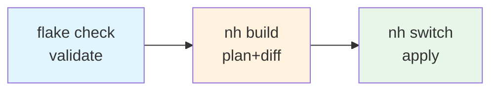

# Configuration Validation

A staged approach to validate Nix configuration changes before applying them.
Each step is cheaper than the next and catches a different class of error —
running them in order means failures surface as early as possible.

## The Pipeline



## Standard Workflow

For routine configuration changes:

```bash
# 1. Validate flake structure — catches schema errors before any build starts
nix flake check --no-build

# 2. Dry build with package diff — shows what will be built/removed without applying
nh os build --dry

# 3. Apply configuration (run manually when you decide to apply)
nh os switch
```

In team workflows where builds and applies are user-gated, stop after step 2
until the operator explicitly approves step 3.

`nh` is preferred over `nixos-rebuild` because it shows a readable diff of
added/removed packages, size comparison, and cleaner error output.

## Flake Layout

`flake.nix` declares inputs and wires outputs; build logic lives in plain
functions under `nix/`, each taking an explicit attrset:

| Module           | Arguments                | Provides                                                |
| ---------------- | ------------------------ | ------------------------------------------------------- |
| `nix/nim.nix`    | `pkgs lib nimDir`        | `nimShared`, `nimToolchain`, `mkNimTest`, `nimTests`    |
| `nix/ax.nix`     | `pkgs lib nimDir nim`    | command tree, eval-time guards, `axDriver`, `axPackage` |
| `nix/checks.nix` | `pkgs lib nimDir nim ax` | the `checks.${system}` attrset                          |
| `nix/mkhost.nix` | `inputs self system`     | `mkHost { hostPath; role?; homeConfig? }`               |

The host registry (`nixosConfigurations`) and its `# prepare:hosts` marker
stay in `flake.nix` so `Prepare-NewHost` keeps a single edit target.

## When to Use Each Workflow

| Scenario                   | Workflow                                                    |
| -------------------------- | ----------------------------------------------------------- |
| Adding a package           | Apply directly                                              |
| Routine config changes     | Standard (Check → Plan → Apply)                             |
| Escaping-sensitive changes | Standard + [inspect derivation](#debugging-escaping-issues) |
| Large refactors            | Standard + careful inspection                               |

## Debugging Escaping Issues

When migrating dotfiles to pure Nix, escaping bugs are common and invisible
until the generated file is read directly. Two extra steps help:

### Parse the module

Before `flake check`, you can parse a single module in isolation to catch syntax
errors, undefined variables, and type mismatches without evaluating the whole
flake:

```bash
nix eval --impure --expr '
  (import <nixpkgs> {}).lib.trivial.id
  (import ./home/<module>.nix { config = {}; pkgs = import <nixpkgs> {}; })
'
```

### Realise and inspect the derivation

After `nh os build --dry`, take the `.drv` path from the output and realise it
to read the actual generated file. This is the only way to verify that escape
sequences and string interpolations produced the expected bytes:

```bash
# Build a specific derivation from dry build output
nix-store --realise /nix/store/<hash>-<name>.drv

# Read the generated file directly
cat /nix/store/<hash>-<name>
```

## Quick Reference

| Step    | Command                          | Catches                                          |
| ------- | -------------------------------- | ------------------------------------------------ |
| Check   | `nix flake check --no-build`     | Schema violations, missing inputs, option errors |
| Plan    | `nh os build --dry`              | Missing dependencies; shows derivations to build |
| Apply   | `nh os switch`                   | Runtime failures (manual/apply gate)             |
| Parse   | `nix eval --impure --expr '...'` | Syntax errors, undefined vars (debugging only)   |
| Inspect | `nix-store --realise` + `cat`    | Incorrect escaping, malformed output             |
