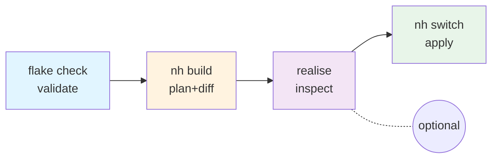

# Configuration Validation

A staged approach to validate Nix configuration changes before applying them.
Each step catches different classes of errors.

## The Pipeline



## Standard Workflow

For routine configuration changes:

```bash
# 1. Validate flake structure
nix flake check --no-build

# 2. Dry build with package diff
nh os build . --dry -d always

# 3. Apply configuration
nh os switch .
```

## Extended Workflow

For escaping-sensitive changes (e.g., migrating dotfiles to pure Nix):

### 1. Parse & Evaluate Module

```bash
nix eval --impure --expr '
  (import <nixpkgs> {}).lib.trivial.id
  (import ./home/<module>.nix { config = {}; pkgs = import <nixpkgs> {}; })
'
```

**Catches:** Syntax errors, undefined variables, type mismatches

### 2. Flake Check

```bash
nix flake check --no-build
```

**Catches:** Missing inputs, schema violations, Home Manager option errors

### 3. Dry Build

```bash
nh os build . --dry -d always
```

**Catches:** Missing dependencies, shows derivations to be built

### 4. Realise & Inspect

```bash
# Build specific derivation from dry build output
nix-store --realise /nix/store/<hash>-<name>.drv

# Inspect the generated file
cat /nix/store/<hash>-<name>
```

**Catches:** Incorrect escaping, malformed output

### 5. Apply

```bash
nh os switch .
```

## Quick Reference

| Step    | Command                          | When to Use        |
| ------- | -------------------------------- | ------------------ |
| Check   | `nix flake check --no-build`     | Always             |
| Plan    | `nh os build . --dry -d always`  | Before applying    |
| Parse   | `nix eval --impure --expr '...'` | Debugging syntax   |
| Inspect | `nix-store --realise` + `cat`    | Verifying escaping |
| Apply   | `nh os switch .`                 | Deploying changes  |

## When to Use Each Workflow

| Scenario                   | Workflow                         |
| -------------------------- | -------------------------------- |
| Adding a package           | Apply directly                   |
| Routine config changes     | Standard (Check → Plan → Apply)  |
| Escaping-sensitive changes | Extended (all steps)             |
| Large refactors            | Extended with careful inspection |

## Why `nh` over `nixos-rebuild`

- Readable diff showing added/removed files
- Size comparison before/after
- Progress visualization with dependency graph
- Cleaner error output
