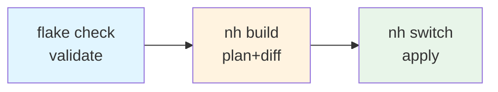

# Configuration Validation

A staged approach to validate Nix configuration changes before applying them.
Each step is cheaper than the next and catches a different class of error —
running them in order means failures surface as early as possible.

## The Pipeline


```mermaid
flowchart LR
    A[flake check<br/>validate] --> B[nh build<br/>plan+diff]
    B --> C[nh switch<br/>apply]

    style A fill:#e1f5ff
    style B fill:#fff3e0
    style C fill:#e8f5e9
```

## Standard Workflow

For routine configuration changes:

```bash
# 1. Evaluate Nix options and assertions; this does not run check derivations
nix flake check --no-build

# 2. Dry build with package diff — shows what will be built/removed without applying
nh os build --dry

# 3. Apply configuration (run manually when you decide to apply)
nh os switch
```

In team workflows where builds and applies are user-gated, stop after step 2
until the operator explicitly approves step 3.

`nh` is preferred over `nixos-rebuild` because it shows a readable diff of
added/removed packages, size comparison, and cleaner error output.

## Flake Layout

`flake.nix` declares inputs and wires outputs; build logic lives in plain
functions under `nix/`, each taking an explicit attrset:

| Module           | Arguments                | Provides                                                |
| ---------------- | ------------------------ | ------------------------------------------------------- |
| `nix/nim.nix`    | `pkgs lib nimDir`        | `nimShared`, `nimToolchain`, `mkNimTest`, `nimTests`    |
| `nix/ax.nix`     | `pkgs lib nimDir nim`    | command tree, eval-time guards, `axDriver`, `axPackage` |
| `nix/checks.nix` | `pkgs lib nimDir nim ax` | the `checks.${system}` attrset                          |
| `nix/mkhost.nix` | `inputs self system`     | `mkHost { hostPath; role?; homeConfig? }`               |

The host registry (`nixosConfigurations`) and its `# prepare:hosts` marker stay
in `flake.nix` so `Prepare-NewHost` keeps a single edit target.

## When to Use Each Workflow

| Scenario                   | Workflow                                                    |
| -------------------------- | ----------------------------------------------------------- |
| Adding a package           | Apply directly                                              |
| Routine config changes     | Standard (Check → Plan → Apply)                             |
| Escaping-sensitive changes | Standard + [inspect derivation](#debugging-escaping-issues) |
| Large refactors            | Standard + careful inspection                               |

## Native Configuration Checks

For changes to the extracted tmux, dircolors, Starship, or Neovim configuration:

```bash
nix build --no-link .#checks.x86_64-linux.home-config
```

This focused derivation uses tools from the pinned nixpkgs input. It checks:

- Neovim's two native Lua files with the LuaJIT parser, without executing them.
- The dircolors fragment read by its Home Manager module with `dircolors`.
- The tmux fragment read by its Home Manager module with `source-file -n`, using
  a private socket and temporary server that is cleaned up on exit.
- Both native and Nix-generated Starship TOML with `starship print-config`,
  rejecting diagnostic output rather than silently accepting fallback defaults.

These are syntax and configuration-loading checks, not comprehensive runtime
tests. They do not execute Neovim plugins, run tmux bindings, or validate every
Starship format string and module option. Test those behaviors separately when
changing them. `nix flake check --no-build` evaluates the check derivations but
does not run their parsers; the command above builds just the relevant check.

For additional one-off tools on NixOS, use `nix run`, `nix shell`, or the project's
`nix develop` environment. Do not assume language tools are installed globally.

### Extraction Regression Checks

When moving configuration between Nix and native files, compare evaluated values
before and after the edit. Compare text fragments byte-for-byte, including the
final newline, and compare parsed TOML or JSON as structured values. Preserve
plugin order and initialization priority, not just individual settings.

For example, inspect the effective tmux fragment without switching generations:

```bash
home_config=.#nixosConfigurations.ambul8r.config.home-manager.users.axl
nix eval --raw "$home_config.programs.tmux.extraConfig"
```

Add new source files to Git before flake evaluation; untracked files are not
included in a Git-backed flake source. Full application configuration may also
include module defaults and generated plugin setup, so inspect the final file
when testing composition or ordering.

See [packages.md](packages.md#configuration-ownership) for the native-file/Nix
ownership policy.

## Debugging Escaping Issues

When embedding native text in Nix, escaping bugs can remain invisible until the
evaluated text or generated file is inspected. Prefer native files when Nix
interpolation is unnecessary. Plain `$variable` does not need escaping in Nix;
literal `${variable}` does. Two extra steps help:

### Parse the module

Before `flake check`, parse a single module to catch Nix syntax errors without
evaluating the whole flake:

```bash
nix-instantiate --parse home/neovim.nix > /dev/null
```

Parsing alone does not check undefined variables, option types, or the syntax
of a language inside a string. Evaluation and native checks cover those distinct
layers.

### Realise and inspect the derivation

After `nh os build --dry`, take the `.drv` path from the output and realise it
to read the actual generated file. This checks the final bytes after module
composition and serialization, beyond what inspecting an individual option shows:

```bash
# Build a specific derivation from dry build output
nix-store --realise /nix/store/<hash>-<name>.drv

# Read the generated file directly
cat /nix/store/<hash>-<name>
```

## Quick Reference

| Step    | Command                                                 | Catches                                          |
| ------- | ------------------------------------------------------- | ------------------------------------------------ |
| Check   | `nix flake check --no-build`                            | Schema violations, missing inputs, option errors |
| Plan    | `nh os build --dry`                                     | Missing dependencies; shows derivations to build |
| Apply   | `nh os switch`                                          | Runtime failures (manual/apply gate)             |
| Native  | `nix build --no-link .#checks.x86_64-linux.home-config` | Native syntax and configuration loading          |
| Parse   | `nix-instantiate --parse home/neovim.nix`               | Nix syntax only                                  |
| Inspect | `nix-store --realise` + `cat`                           | Incorrect escaping, malformed output             |
