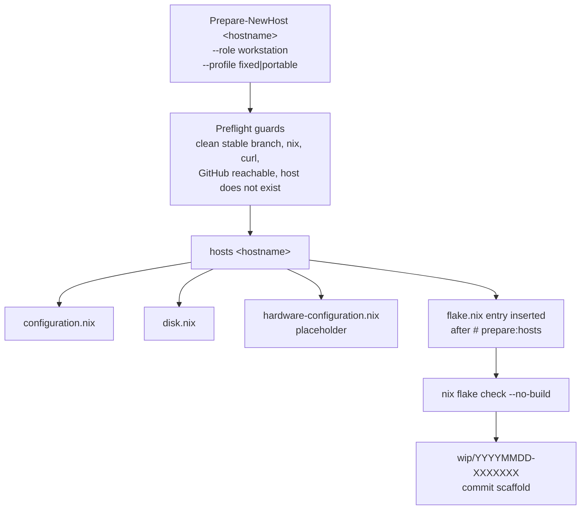
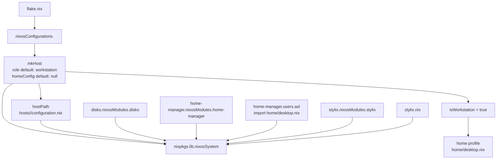
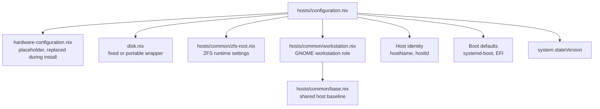
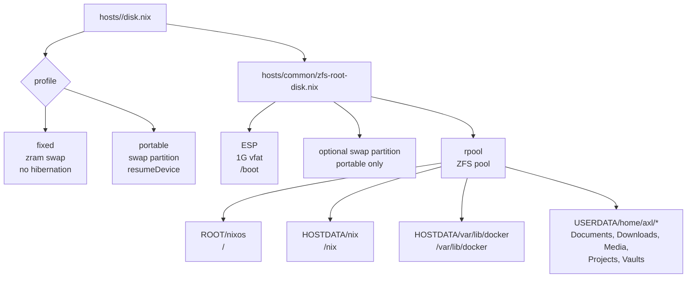
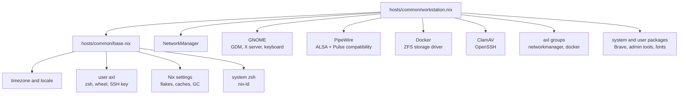
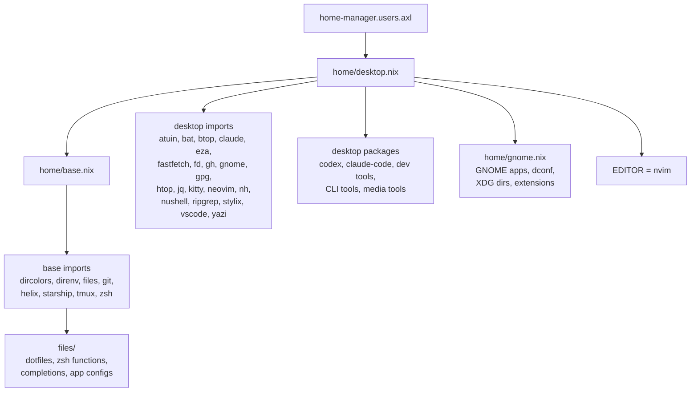
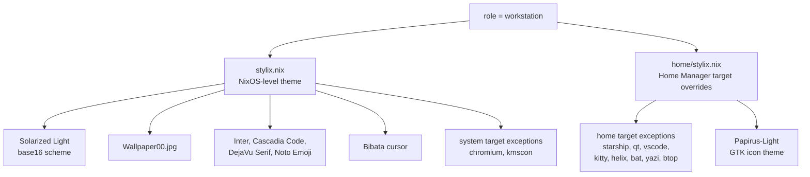
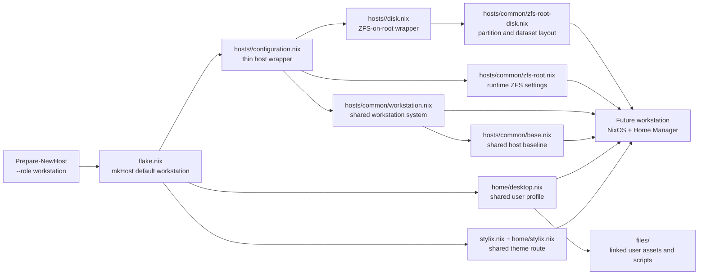

# Workstation Configuration Route
This document shows what future Nixotic workstation hosts look like when they
are scaffolded through `Prepare-NewHost` and evaluated through `flake.nix`.

It describes the reusable workstation shape rather than the existing `ambul8r`
laptop. The key difference is that future workstations use the shared
ZFS-on-root disk wrapper by default, while `ambul8r` keeps its legacy ext4
plus `dpool` layout until a future reinstall.

The diagrams show configuration composition and ownership boundaries. They do
not show imperative execution order; NixOS and Home Manager modules are merged
by their respective module systems.

Unless stated otherwise, diagrams in this document describe the scaffolded
future-state route, not the current `ambul8r` host file.


## Scaffold Route
A future workstation normally starts with `Prepare-NewHost`.

```bash
Prepare-NewHost <hostname> --role workstation --profile fixed
```

For a portable workstation, usually a laptop:

```bash
Prepare-NewHost <hostname> --role workstation --profile portable
```

Because `workstation` is the default role, omitting `--role workstation` has the
same result.



The generated flake entry for a workstation is intentionally thin:

```nix
<hostname> = mkHost { hostPath = ./hosts/<hostname>/configuration.nix; };
```

No explicit `role` is needed because `mkHost` defaults to
`role = "workstation"`.


## Flake Route
`flake.nix` turns the generated host entry into a full NixOS configuration.



For every future workstation, `mkHost` adds:

- the host's own `configuration.nix`
- Disko support
- Home Manager as a NixOS module
- `home/desktop.nix` for user `axl`
- Stylix's NixOS module
- the root `stylix.nix` theme configuration


## Generated Host Module
For a workstation, `Prepare-NewHost` generates this import shape:

```nix
{
  imports = [
    ./hardware-configuration.nix
    ./disk.nix
    ../common/zfs-root.nix
    ../common/workstation.nix
  ];

  boot.loader.systemd-boot.enable = true;
  boot.loader.efi.canTouchEfiVariables = true;

  networking.hostName = "<hostname>";
  networking.hostId = "<random-8-hex-chars>";

  system.stateVersion = "25.11";
}
```

Current-state note: `ambul8r` is a legacy workstation and does not currently
import `../common/zfs-root.nix`; it keeps its existing ZFS/runtime settings in
`hosts/ambul8r/configuration.nix`.

That file is deliberately small. It owns only the host identity and the first
boot defaults. Hardware quirks are added there later only when the running
machine proves it needs them.




## Disk Route
Future workstations use the shared ZFS-on-root Disko layout in
`hosts/common/zfs-root-disk.nix`.

For a fixed workstation, `disk.nix` is generated as:

```nix
import ../common/zfs-root-disk.nix {
  device = "/dev/nvme0n1";
  swap   = "zram";
}
```

For a portable workstation, `disk.nix` is generated as:

```nix
import ../common/zfs-root-disk.nix {
  device      = "/dev/nvme0n1";
  swap        = "hibernate";
  swapSizeGiB = 64;
}
```

Before install, the `device` must be checked against the target machine with
`lsblk`. For portable hosts, `swapSizeGiB` should be set to at least the
machine's RAM.




## Workstation System Role
The shared workstation role is `hosts/common/workstation.nix`. It imports the
shared base role and then adds desktop system behavior.



This role is the reusable system-level template for workstations. Host-specific
hardware should not be added here unless it applies to all future workstations.


## Home Manager Route
All workstation hosts use the same Home Manager profile as `ambul8r`:
`home/desktop.nix`.



This is what makes future workstations share the same user environment as
`ambul8r`. To keep that true, future workstation entries in `flake.nix` should
not set a custom `homeConfig`.


## Stylix Route
Future workstations also get the same Stylix route as `ambul8r`.




## Full Future Workstation Graph
This is the complete reusable workstation route in one diagram.




## What Future Workstations Share
Future workstation hosts share:

- the same `mkHost` workstation path in `flake.nix`
- the same system baseline from `hosts/common/base.nix`
- the same workstation system role from `hosts/common/workstation.nix`
- the same ZFS-on-root layout from `hosts/common/zfs-root-disk.nix`
- the same ZFS runtime settings from `hosts/common/zfs-root.nix`
- the same Home Manager profile from `home/desktop.nix`
- the same user dotfile source tree under `files/`
- the same Stylix theme path

They should differ only where the physical machine requires it:

- disk device name
- fixed versus portable swap profile
- generated hardware configuration
- GPU driver and bus IDs
- hibernation, suspend, or firmware quirks
- host-specific services or peripherals


## Where Changes Belong
| Change type | Usual location |
| --- | --- |
| Make every future workstation behave differently at the system level | `hosts/common/workstation.nix` |
| Make every host behave differently, workstation or server | `hosts/common/base.nix` |
| Change the default future workstation disk layout | `hosts/common/zfs-root-disk.nix` |
| Change runtime ZFS behavior for new ZFS-on-root hosts | `hosts/common/zfs-root.nix` |
| Change all workstation user tools or dotfiles | `home/desktop.nix`, imported `home/*.nix`, or `files/` |
| Change GNOME user preferences or desktop apps | `home/gnome.nix` |
| Change shared workstation theming | `stylix.nix` or `home/stylix.nix` |
| Add one machine's hardware-specific settings | `hosts/<hostname>/configuration.nix` |
| Change how hosts are composed | `flake.nix` |

The rule of thumb is simple: shared workstation policy goes in the shared
workstation modules; machine facts and quirks stay in the generated host
directory.
